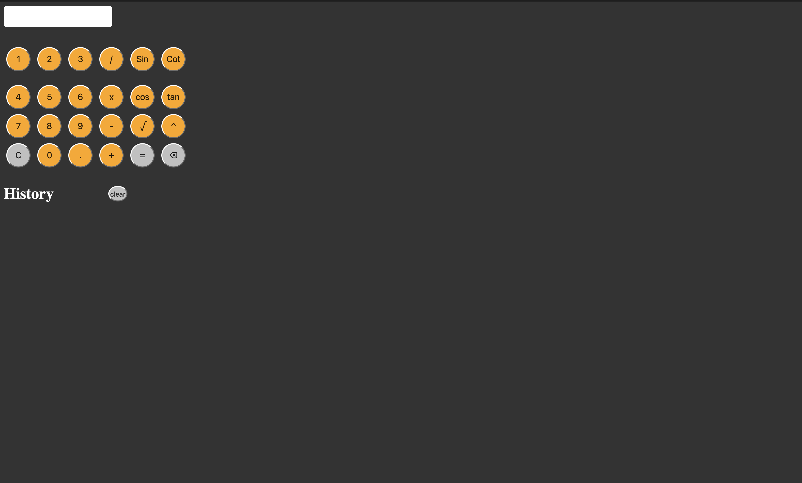

# Simple-Calculator

A simple browser-based calculator made with HTML, JavaScript and CSS. This is not a really BIG project but I am very proud of this project as this is my very first working app made in HTML. 

## Features

- Basic Arithmetic: addition, subtraction, multiplication, division
- Clear(C) and Backspace buttons (⌫)
- Keyboard Support (type digits, operators, Enter to calculate, Esc to clear)
- Scientific Buttons: `sin`, `cos`, `cot`, `tan`
- Square Root (√)
- Power `^`
- History (saved with localStorage)
- Clear History
- Decimal and Parentheses support
- Error handling for invalid expressions, really needed this

## Keyboard shortcuts

| Key | Action |
|-----|--------|
| `0-9`, `+`, `-`, `*`, `/`, `.`, `^`, `(`, `)` | Input |
| `Enter` or `=` | Calculate |
| `Backspace` | Delete last character |
| `Escape` | Clear display |

## What I learned 

Personally, I learnt a lot of Html, Js and a little Css . I understand how to create functions, but sometimes I needed to Google what method is used to do what I want done. Anyhow, it was really good working with this project. I have done other projects, but this one is very special for me because it taught me how to write JS, HTML, and CSS from a blank page down.

## Quick Preview

## Try it out 

- https://srinivasagudi0.github.io/Simple-Calculator/ 
